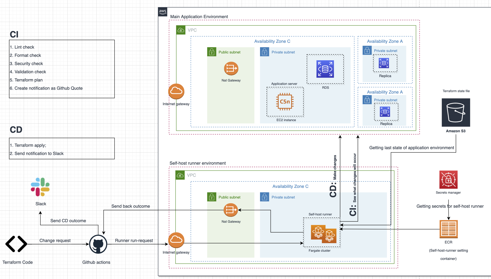

# Automating Terraform in Github Actions with self-host runner in AWS

This repository aims to create Infra-CI-CD pipeline by using Github Actions with Self-host runner in ECS for the infrastructure in AWS

## Introduction

Figure below represents Diagram of Infra-CI-CD we are going to build in this article. The diagram consists of following features:



Feature                       | Role
----------------------------- | -------------
Main application environment  | This is the environment where our application runs. For the simplicity. I only included some services including RDS and EC2 instance in Private Subnets. This infrastructure will be built with Terraform and be target of our CI-CD pipeline: we are going to build CI-CD to change the services in this environment.
Self-host runner environment  | This is the environment where our self-host runners for Github actions run and make changes to the application environment. Note that instead of self-host runners, you can also run default runners of Github Actions. However, in this case security problem arises: you should give this runner very strong "AWS Admin role" in order to change services. Furthermore, in order to access to AWS, this default runner should get AWS Secret Access Keys and IDs. I found that submitting these secrets and role to Github Actions and Runner is dangerous and decided to use self-host runners in AWS ECS with Admin Role which is located safely in private subnet under my control and get any secrets (e.g. github tokens) from Secrets Manager. If you want, you can reduce permissions for the runner. For example, if it is required to change ECS, you can give the runner only ECS Admin. This environment for self-host runner is also built with Terraform which I am going to show later.
Github Actions               | When a code is committed to Github and Pull request is created, Github Actions are run with self-host runner and CI is started. There are following steps in CI: Lint check, Terraform code format check, Security check (checks if there is any security issue in the changed application Terraform file), Terraform code validation check, Terraform plan (to see what changes will occur), Create notification to Github Comment about changes in AWS services in application environment. <br /> If you merge the code to the master branch, CD starts in self-host runner. CD includes following steps: <br /> 1. Terraform apply: apply the code and make changes to the infrastructure environment　<br /> 2. Send notification to Slack channel about changes in services so that your team can see what services have been added, removed or changed. <br />
S3 bucket | In order to keep terraform state file, S3 bucket is used. Self-host runner accesses to this bucket and understands the current state of the application environment and conducts CI-CD.

## Building Infra-CI-CD

## Environment setup

Setting environment variables to enable Terraform access to AWS account
```
export AWS_DEFAULT_REGION="{AWS account default zone}"
export AWS_SECRET_ACCESS_KEY="{AWS account secret access key}"
export AWS_ACCESS_KEY_ID="{AWS account access key id}"
```

