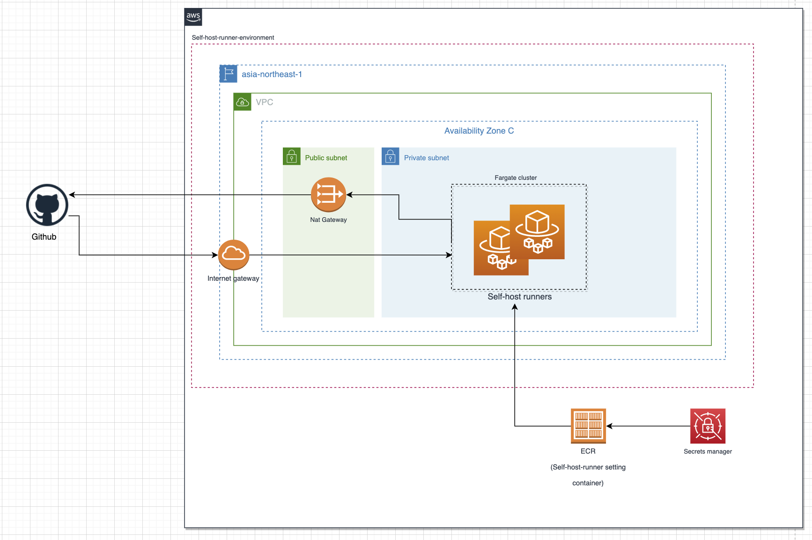

# Self Hosted Runners on ECS

## Overview

Compared to Github-hosted runners, you have more control of hardware and operating system when you use self-hosted runners for your github actions. This repository showcases how to deploy this self-hosted runner in AWS's ECS by using container configuration. In order to run ECS in secure environment, you should also configure other AWS services such as VPC, subnets and internet gateways. This environment configuration has been already prepared in "infrastructure" terraform file which creates environment as following:



Note that although we can save secrets in Github secrets, I thought that AWS secrets manager is much safer. Therefore, all the secrets needed to run self-host runner including the environment variables defined below are saved in AWS secrets manager and self-host runner accesses these secrets while running.

## Steps to initiate self host runner

### Step 1: Setting environment variables

```
export PAT={YOUR_PAT_HERE}
export ORG={YOUR_GITHUB_ORG_HERE}
export REPO={YOUR_GITHUB_REPO_NAME_HERE}
export AWS_DEFAULT_REGION={YOUR_AWS_DEFAULT_REGION_HERE}
export AWS_SECRET_ACCESS_KEY={YOUR_AWS_SECRET_ACCESS_KEY_HERE}
export AWS_ACCESS_KEY_ID={YOUR_AWS_ACCESS_KEY_ID_HERE}
export AWS_ACCOUNT_ID={YOUR_AWS_ACCOUNT_ID_HERE}
```

### Step 2: Setting Backend Bucket for Terraform state file

In order to support state locking and consistency, AWS s3 bucket has been used as a backend. The settings of the backend have already been done in backend file. If your default region is different from "ap-northeast-1", do not forget to change default region in this file to your region.
**Note: You should also change zones and regions to your regions and zones in infrastructure file.
**

### Step 3: Choosing prefix for service names

The self-host runner is run in AWS and in order to secure the self-host runner, you should use some services of AWS such as VPC, Subnets etc. If your AWS environment has several services already been run for other purposes, you do not want them mixed with the ones run for self-host-runner. In order to differentiate the services run for self-host-runner from the ones run for other purposes in your AWS environment, you should set prefixes for the names of your environment. You can achieve this by setting "PREFIX" in the variables file: change the default value to the value you like. If you do not change, the prefix for your services' name become "ecs-runner".

### Step 4: Running terraform

```
terraform init
terraform plan
terraform apply
```

### Step 5: Logging in AWS

```
aws ecr get-login-password | docker login --username AWS --password-stdin $AWS_ACCOUNT_ID.dkr.ecr.ap-northeast-1.amazonaws.com
```

### Step 6: Building and push container to ECR

```
docker build -f Dockerfile -q -t ecs-runner .
docker tag ecs-runner $AWS_ACCOUNT_ID.dkr.ecr.ap-northeast-1.amazonaws.com/ecs-runner
docker push $AWS_ACCOUNT_ID.dkr.ecr.ap-northeast-1.amazonaws.com/ecs-runner
```
